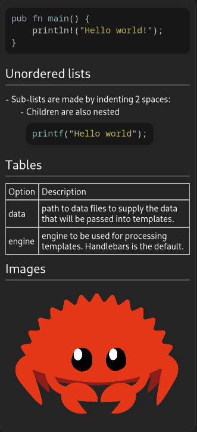

> **Warning**
>
> This library is in **alpha** state. Not all features have yet been implemented, and breaking API changes can still happen.

A library to render different flavors of the CommonMark (markdown) language as GTK4 widgets.

# Example

```rust
// Parse the input and get a `gtk::Viewport` in return
let viewport = render_input(INPUT_MARKDOWN, RenderConfig::default()).unwrap();

// Create a scrollable area to put the viewport in, with a clamp to limit its width
let scrollable = gtk::ScrolledWindow::new();
scrollable.container_add(&viewport);
let clamp = adw::Clamp::builder().maximum_size(800).build();
clamp.container_add(&scrollable);

// Use the created widgets
root.container_add(&clamp);
```



# To do

- [ ] add the option to load images from the Internet
- [ ] implement embedding images at compile-time
- [ ] implement a cache if re-rendering is necessary (although it shouldn't be used for dynamic display)
- [ ] implement rendering for the remaining nodes:
  - [ ] `FootnoteReference`
  - [ ] `LinkReference`
  - [ ] `Definition`
  - [ ] `ImageReference`
  - [ ] `Math`
  - [ ] `InlineMath`
  - [ ] `Html`
  - [ ] `MdxjsEsm`
  - [ ] `Toml`
  - [ ] `Yaml`
  - [ ] `FootnoteDefinition`
  - [ ] `MdxJsxFlowElement`
  - [ ] `MdxJsxTextElement`
  - [ ] `MdxTextExpression`
  - [ ] `MdxFlowExpression`
- [ ] publish on crates.io

# Acknowledgements

- Thanks the [markdown-rs](https://github.com/wooorm/markdown-rs) crate author and contributors for making a robust and safe Markdown parser.
- Thanks to the [GTK](https://www.gtk.org/) and [gtk4-rs](https://github.com/gtk-rs/gtk4-rs) devs and contributors!
